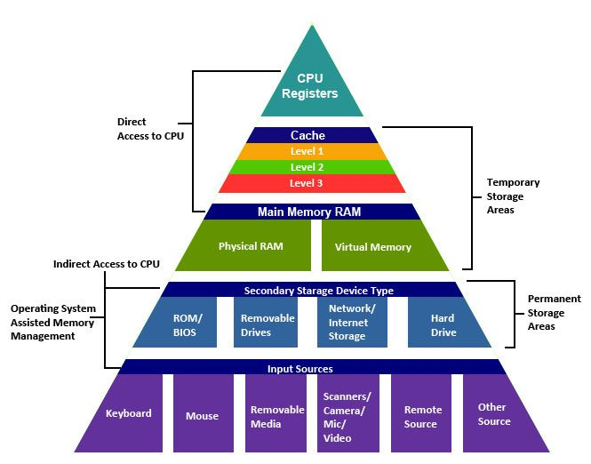
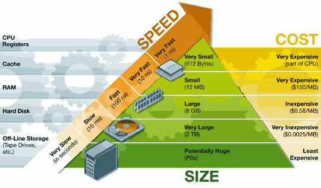
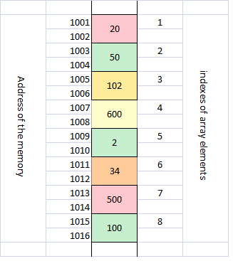

# **Memory**
----------------------------
### What is Memory? 

- Memory is a electronic holding place for instruction and data that a CPU needs to reach quickly. 
- Memory is used by computer operating system , hardware and software(Basically everything). 
- There are two types of memory i.e Primary memory and Secondary memory.  
- We should not confuse memory with storage.
----------------------------
### Difference between Memory and Storage

Memory is the primary memory and Storage is secondary memory. 

RAM (Random access memory) is a primary memory. Memory is also a place where information is processed. It enables user to access data that will be available for a shorter period. RAM or Primary memory is physically placed very closer to the processing unit so it is faster to retrive and store data. This memory is volatile meaning the content stored here cannot be retained once we turn off the power supply. 

The term storage refers to secondary memory where the data in a computer is kept. Example of a computer storage is hard drive or hard disk drive (HDD). Storage is non-volatile meaning the information is kept safe even after the power supply is turned off. 

The information and files required by a program that is running is kept in the memory and stored in storage after it is closed.

-----------------------------
### Why RAM is lesser than ROM in computers and devices ? 

In general a computer will have higher ROM than RAM. For Example, A computer can have 8Gb RAM and 250Gb ROM. The difference in space is because the computer won't need all the files immediately to access. So allocating 8Gb or 16Gb is enough for a computer to run programs seamlessly. Cost is also an important factor for lesser RAM . 

-----------------------------
### What are the types of memory used in applications: 

- **Cache Memory**
- **RAM**         (Random Access Memory)
- **DRAM**        (Dynamic RAM)
- **SRAM**        (Static RAM)
- **DDR SRAM**    (Double Data Rate Static RAM)
- **DDR4 SRAM**   (Double Data Rate 4 Synchronous Dynamic RAM)
- **DRDRAM**      (Rambus Dynamic RAM)
- **ROM**         (Read Only Memory)
- **PROM**        (Programmable RAM)
- **EPROM**       (Erasable PROM)
- **EEPROM**      (Electrically Erasable PROM)
- **Virtual Memory**
------------------------------
### Types of Memory in detail : 

##### RAM : 

- RAM (Random Access Memory) is a computer memory where data and machine code is stored. 
- It is volatile. In today's tech , RAM comes in form of IC's with MOS(Metal Oxide semiconductor) memory cells. 
- First commercial RAM was introduced by IBM in the year 1960. It is physically very close to the processing unit which makes it very fast to access. 

##### DRAM :

- DRAM (Dynamic RAM) is a common type of RAM that is used generally in Personal Computers (PC) and servers.
- Memory is made up of bits or program codes thats are in shape of a grid. 
- DRAM will store a bit in a memory cell (capacitor & transistor). These storage cells are arranged in rectangular configuration.
- When a charge is sent through a column , transistors at that particular column is activated.
- DRAM is Dynamic in nature i.e it needs to be refreshed or it should supply charges for every milli-second to componsate the charge leaks from capacitor. 
- DRAM is first introduced in TOSHIBA calculators in 1965. 

##### SRAM : 
- SRAM (static RAM) is predecessor to DRAM. 
- SRAM does not require refresh because it operates on the principle of switching the current flow in one of two direction rather than holding the charge like DRAM.
- SRAM is generally used in cache memory which can be accessed more quickly than DRAM.
- SRAM is also a part of the RAM Digital to Analog converter.

##### DDRAM : 
- Double Data Rate Synchronous Dynamic RAM (DDRAM)
- It is a memory that transfers data twice as fast compared to SDRAM. 
- DDRAM memory can send and recieve signals as twice in a clock cycle. 
- This memory is used in graphic processing for efficiency.

-------------------------------
  
##### What is a variable and how it is stored ? :

To understand variables we have to understand how the memory works in a computer.

- Computers have GB's of memory and each bytes of these memory has a unique address. 
- We can visualize the RAM to be huge array of bytes and the address as the index of each array element. 
- Most array has content that are more than a byte so the starting address of the variable is considered. 
 

 
